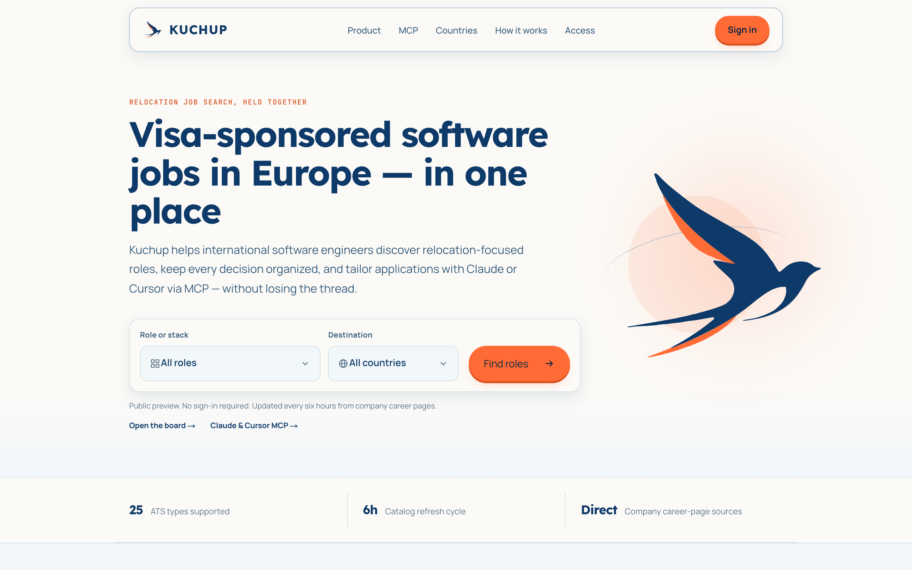
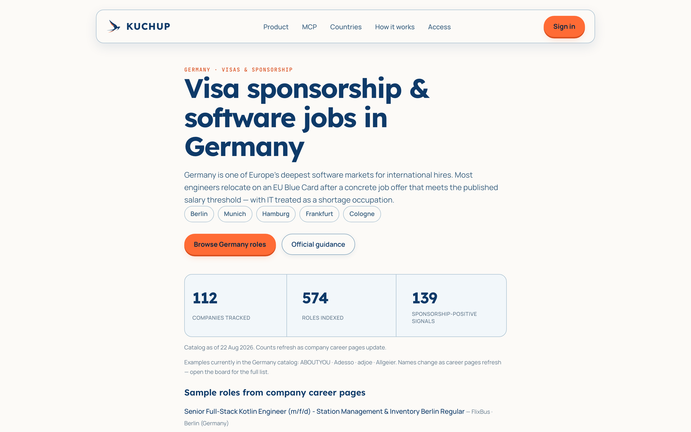
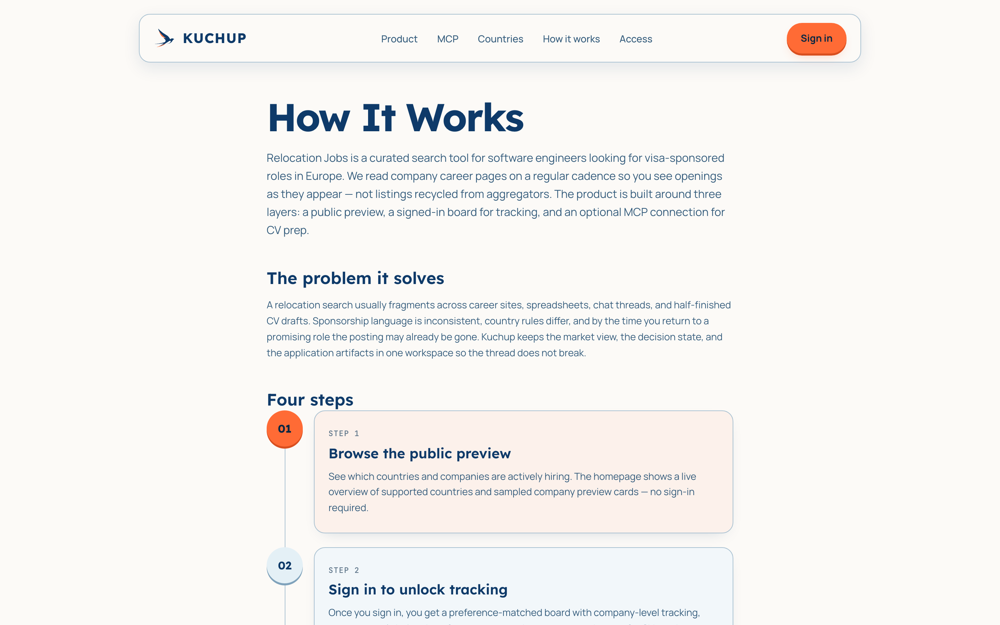
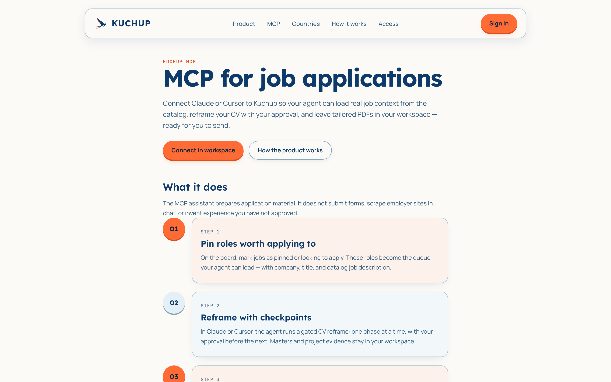

<p align="center">
  
</p>

<h1 align="center">Kuchup</h1>

<p align="center">
  <strong>Visa-sponsored software jobs in Europe — in one place</strong><br>
  A relocation job-search workspace for international software engineers:
  discover roles from company career pages, keep every decision attached to
  the company, and prepare applications with Claude or Cursor via MCP.
</p>

<p align="center">
  <a href="https://kuchup.com"></a>
  <a href="https://github.com/AminMortezaie/relocation-jobs/actions/workflows/ci.yml"></a>
</p>

<p align="center">
  <a href="https://kuchup.com">Product</a>
  ·
  <a href="https://kuchup.com/mcp">MCP</a>
  ·
  <a href="https://kuchup.com/how-it-works">How it works</a>
  ·
  <a href="docs/contributing.md">Contributing</a>
  ·
  <a href="docs/README.md">Docs</a>
</p>

<p align="center">
  
</p>

---

[kuchup.com](https://kuchup.com) is the production product behind this
repository. Company lists start from [relocate.me](https://relocate.me). Each
employer’s ATS is detected, openings are scraped into a shared Postgres catalog,
and a multi-user panel tracks applications. A Claude / Cursor **MCP** pipeline
prepares tailored LaTeX/PDF resumes and cover letters per role. You review and
submit — Kuchup never auto-applies.

**Countries:** Germany, Netherlands, United Kingdom, Portugal, and Ireland
(plus custom countries from the panel).

| Discover | Track | Prepare |
|----------|-------|---------|
| Catalog built from company career pages, not syndicated job-board feeds. Refresh every **6 hours**. | Personal state (applied, looking to apply, not for me, pin) stays on the company and role. | MCP loads the JD, master CV, and project evidence. Gated reframe — you approve each phase. |

<p align="center">
  
</p>

<table>
  <tr>
    <td width="50%"></td>
    <td width="50%"></td>
  </tr>
  <tr>
    <td align="center"><em>Public preview → signed-in board → MCP</em></td>
    <td align="center"><em>Claude &amp; Cursor MCP — you still submit</em></td>
  </tr>
</table>

---

## Features

| Area | What you get |
|------|----------------|
| **Company discovery** | Careers URL discovery from relocate.me → Postgres (`build_companies`) |
| **ATS ingestion** | 25 ATS types (Greenhouse, Lever, Ashby, Personio, Workable, Workday, …) plus Playwright fallback |
| **Concurrent scrape** | asyncio + httpx (up to **16** workers); relevance include/exclude keywords |
| **Shared catalog + per-user overlay** | Tracking merged at read time — applied / reject / not-for-me / pin / looking-to-apply |
| **Web panel** | Paginated board (`GET /api/board`, default **25**/page), filters, fetch, add company |
| **Scheduled fetch** | Production Playwright worker every **6 hours** |
| **Application assistant** | MCP: masters, project masters, gated JD-mirror reframe, validate, PDF (`tectonic`) |
| **Company workspace** | `/company/<country>/<slug>` — positions, CV / cover letter, live PDF preview |

---

## Repo map

One product, one repo. Panel, workers, and MCP share Postgres, `core/`, and migrations.

```
apps/                 deployables — panel, fetch-worker, opportunity-worker, mcp
relocation_jobs/      domains — catalog, positions, panel, fetch, scrape, users, …
frontend/             React board widget → relocation_jobs/static/dist/
homepage/             marketing site (Next.js; same-origin /api/public/*)
scripts/              ops helpers + Docker entry paths
docs/                 documentation
tests/                pytest (mirrors relocation_jobs/ domains)
```

| I want to… | Go here |
|------------|---------|
| Run the panel | `python3 apps/panel/run.py` (or `scripts/panel_server.py`) |
| Run a worker | `apps/fetch-worker/`, `apps/opportunity-worker/` |
| Run MCP | `apps/mcp/run.py` (stdio) / `apps/mcp/run_http.py` |
| Change domain logic | `relocation_jobs/<domain>/` |
| Full app list | [`apps/README.md`](apps/README.md) |

---

## Quick start

```bash
pip install -r requirements-dev.txt
python3 -m playwright install chromium

cp .env.example .env
# Set DATABASE_URL at minimum (local Postgres is fastest for dev)

PANEL_SCRAPE_ENABLED=1 python3 apps/panel/run.py
# → http://127.0.0.1:5051
```

On first startup the app creates the Postgres schema. Sign in with **Google**
(`GOOGLE_CLIENT_*`). Accounts in `PANEL_ADMIN_EMAILS` become admins. Set
`PANEL_ALLOW_REGISTER=1` to allow new Google users to self-register.

After React UI edits: `cd frontend && npm run build` →
`relocation_jobs/static/dist/board.js`. Hard refresh (`Cmd+Shift+R`) after
JS/CSS changes.

Contributor setup, domains, and coding rules:
[`docs/contributing.md`](docs/contributing.md).

---

## Environment

Copy `.env.example` → `.env`. This repository is **public** — real hosts and
passwords stay in gitignored `.env` / `aws-postgres.env`. Docs use placeholders
only.

| Variable | Purpose |
|----------|---------|
| `DATABASE_URL` | **Required.** Postgres (local or AWS EC2) |
| `REDIS_URL` | Optional country-label cache; Postgres fallback when unset |
| `PANEL_SECRET_KEY` | Flask session signing |
| `GOOGLE_CLIENT_ID` / `GOOGLE_CLIENT_SECRET` | Google OAuth (required for sign-in) |
| `PANEL_ADMIN_EMAILS` | Comma-separated Google emails granted admin |
| `PANEL_SCRAPE_ENABLED` | `1` locally for country + company fetch; `0` on slim production panel |
| `PANEL_COMPANY_FETCH_ENABLED` | `1` on EC2 panel for board **Fetch jobs** without country scrape |
| `PANEL_ALLOW_REGISTER` | Self-service Google registration after first user |
| `PANEL_PUBLIC_BASE_URL` | Panel URL used by MCP “Continue with Google” |
| `MCP_LATEX_CMD` | LaTeX compiler for PDF (default `tectonic`) |

MCP: [mcp-application.md](docs/reference/mcp-application.md) ·
[company-workspace.md](docs/reference/company-workspace.md).
AWS Postgres: `./scripts/aws_postgres_migrate.sh sync-sg` after your public IP
changes — [ops index](docs/README.md).

---

## Usage

### Web panel

```bash
PANEL_SCRAPE_ENABLED=1 python3 apps/panel/run.py   # → :5051
```

Sign in with Google → select a **single country** → **Fetch** (admin) to scrape.
Board: `GET /api/board` (pagination → search → sort/filters).

Re-scrapes **merge by URL** — fetch dates and tracking are preserved. Jobs gone
from an ATS stay as catalog orphans and reappear if you still have tracking.

| Path | Purpose |
|------|---------|
| `/` | Job board |
| `/apply` | Profile, pipeline prompts, master resumes, project masters, interview notes |
| `/company/<country>/<slug>` | Positions, tailored CV / cover letter, PDF preview |

**Claude Desktop / Cursor MCP:** `python3 apps/mcp/run.py` — job context,
application queue, masters, project masters, tailored tex/PDF, cover letters,
`mark_applied`. After an invite: interview notes. See
[mcp-application.md](docs/reference/mcp-application.md).

### Build company lists

```bash
python3 scripts/build_companies.py netherlands
python3 scripts/build_companies.py uk "Monzo"          # single company
python3 scripts/build_companies.py netherlands --sort-only
```

Sort: city (A–Z) → company size (smallest first) → name (A–Z).

### Scrape jobs

Country scrape is an admin **Fetch** on the panel (or the production fetch
worker). First run per company: detect + cache ATS. Later runs hit the ATS API
directly.

```bash
PANEL_SCRAPE_ENABLED=1 python3 apps/panel/run.py
# then Fetch from the board (admin)
```

---

## Architecture

```
relocate.me
    → build_companies          → Postgres catalog
    → scrape / v2 fetch        → Postgres catalog
    → web/ (Flask)             → board API (catalog + per-user merge)
    → mcp/                     → tailored tex / PDF / project masters
    → /company/…               → workspace + mark_applied
```

| Store | Contents |
|-------|----------|
| **Postgres** (`DATABASE_URL`) | Catalog, users, tracking, fetch runs, MCP artifacts |
| **Redis** (`REDIS_URL`) | Optional country-label cache |
| `data/custom_cities.json` | User-added cities (`PANEL_DATA_DIR`) |

**Layer rule:** SQL only in `*/repo.py`. Details:
[architecture.md](docs/reference/architecture.md) ·
[rules.md](docs/reference/rules.md) ·
[apps/README.md](apps/README.md).

---

## Testing

```bash
pytest tests -o addopts=                 # v2 suite
pytest tests/mcp -o addopts=             # MCP / application assistant
pytest --cov --cov-report=term-missing   # coverage gate on business modules
```

In-memory Postgres mock only — no live ATS or production DB. Contracts:
[business-rules.md](docs/reference/business-rules.md).

---

## Production

[kuchup.com](https://kuchup.com) runs on one AWS EC2 host: Postgres, Redis,
panel, fetch worker, and Caddy, with Cloudflare in front. Guide:
[ec2-panel.md](docs/operations/ec2-panel.md).

```bash
./scripts/ec2_app_deploy.sh deploy      # frontend build, rsync, images, restart
./scripts/ec2_app_deploy.sh sync        # UI / static only
./scripts/ec2_app_deploy.sh status
```

Requires gitignored `aws-postgres.env` and a deploy SSH key. After laptop IP
changes: `./scripts/aws_postgres_migrate.sh sync-sg`.

---

## Documentation

| Topic | Doc |
|-------|-----|
| First 15 minutes | [contributing.md](docs/contributing.md) |
| Architecture | [architecture.md](docs/reference/architecture.md) |
| Coding rules | [rules.md](docs/reference/rules.md) |
| Job buckets | [business-rules.md](docs/reference/business-rules.md) |
| MCP / apply / project masters | [mcp-application.md](docs/reference/mcp-application.md) |
| Full doc index | [docs/README.md](docs/README.md) |
