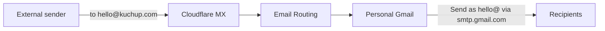

# Domain email (kuchup.com)

Free inbound `@kuchup.com` via **Cloudflare Email Routing**, outbound via **Gmail Send mail as**. No mailbox product.



## Addresses

| Address | Purpose |
|---------|---------|
| `hello@kuchup.com` | Public / product contact |
| `support@kuchup.com` | User help |
| Catch-all | Forward unknown `@kuchup.com` to the same destination |

Destination: one personal Gmail verified in Cloudflare. Do **not** put that personal address in this repo.

## Enable Cloudflare Email Routing

Cloudflare dashboard → **kuchup.com** → **Email** → **Email Routing**:

1. Enable / onboard the domain (Cloudflare adds MX + routing SPF/DKIM).
2. Confirm mail records are **DNS only** (grey cloud) — never orange-proxy MX or mail TXT.
3. Add a destination address (personal Gmail) and confirm the verification email.
4. Create custom addresses: `hello@`, `support@` → that destination.
5. Enable **Catch-all** → same destination.

Typical MX targets (use whatever the dashboard adds):

- `route1.mx.cloudflare.net`
- `route2.mx.cloudflare.net`
- `route3.mx.cloudflare.net`

Leave the existing Google Search Console verification TXT on the apex untouched.

### API token (optional automation)

Custom token scoped to the kuchup.com account/zone:

| Scope | Permission |
|-------|------------|
| Account → Email Routing Addresses | Edit |
| Zone → Email Routing Rules | Edit |
| Zone → DNS | Edit |
| Zone → Zone | Read |
| Zone → Zone Settings | Edit |

`Zone Settings → Edit` is required for `POST /zones/{id}/email/routing/dns` (product enable). Without it, rules/MX can still be created, but Cloudflare may leave routing **unconfigured** until you click Enable in the dashboard or grant that permission.

Env vars (gitignored `.env` only): `CLOUDFLARE_API_TOKEN`, `CLOUDFLARE_ZONE_NAME=kuchup.com`, `CLOUDFLARE_EMAIL_DESTINATION`.

## Outbound: Gmail Send mail as

Cloudflare Routing does **not** send mail.

1. Gmail → **Settings** → **See all settings** → **Accounts and Import** → **Send mail as** → **Add another email address**.
2. Name: e.g. `Kuchup`; address: `hello@kuchup.com` (repeat for `support@` if needed).
3. Treat as an alias. SMTP: `smtp.gmail.com`, port `587`, TLS.
4. Username: your Gmail address; password: a Google [App Password](https://myaccount.google.com/apppasswords) (2-Step Verification required).
5. Complete the confirmation link (Cloudflare forwards it to Gmail).
6. Optionally set default From to `hello@kuchup.com`.

Some clients may show “via gmail.com”. Acceptable for a solo product; move to Google Workspace or a dedicated SMTP relay only if deliverability becomes a problem.

## Auth records (SPF / DKIM / DMARC)

**One SPF TXT on the apex only.** Two SPF records break authentication.

After Email Routing is enabled, edit the apex SPF Cloudflare created and merge Google for outbound into the **same** record:

```text
v=spf1 include:_spf.mx.cloudflare.net include:_spf.google.com ~all
```

Keep Cloudflare’s current `include:` if it differs; add `include:_spf.google.com` once. Do not add a second SPF TXT.

Leave Cloudflare’s routing DKIM (`cf2024-1._domainkey` or the selector shown in the dashboard) as-is.

Add DMARC (monitor first):

| Type | Name | Content |
|------|------|---------|
| TXT | `_dmarc` | `v=DMARC1; p=none; rua=mailto:hello@kuchup.com` |

After a week of clean tests, consider tightening to `p=quarantine`.

## Verify

```bash
dig +short kuchup.com MX
dig +short kuchup.com TXT          # one SPF; GSC verification TXT still present
dig +short _dmarc.kuchup.com TXT
```

Manual checks:

1. From an external account → `hello@kuchup.com` → lands in the destination Gmail.
2. Compose From `hello@kuchup.com` → arrives; check headers or [mail-tester.com](https://www.mail-tester.com) for SPF pass.
3. Confirm Google Search Console still verified (GSC TXT unchanged).

## When to upgrade

| Need | Move to |
|------|---------|
| Shared inbox, Calendar, Drive as `@kuchup.com` | Google Workspace |
| App transactional mail (password reset, notifications) | AWS SES + `noreply@` or a mail subdomain |
| Stricter DMARC alignment / no “via gmail.com” | Workspace or SMTP relay with domain DKIM |

Related: [ec2-panel.md](ec2-panel.md) (Cloudflare DNS for the web origin).
