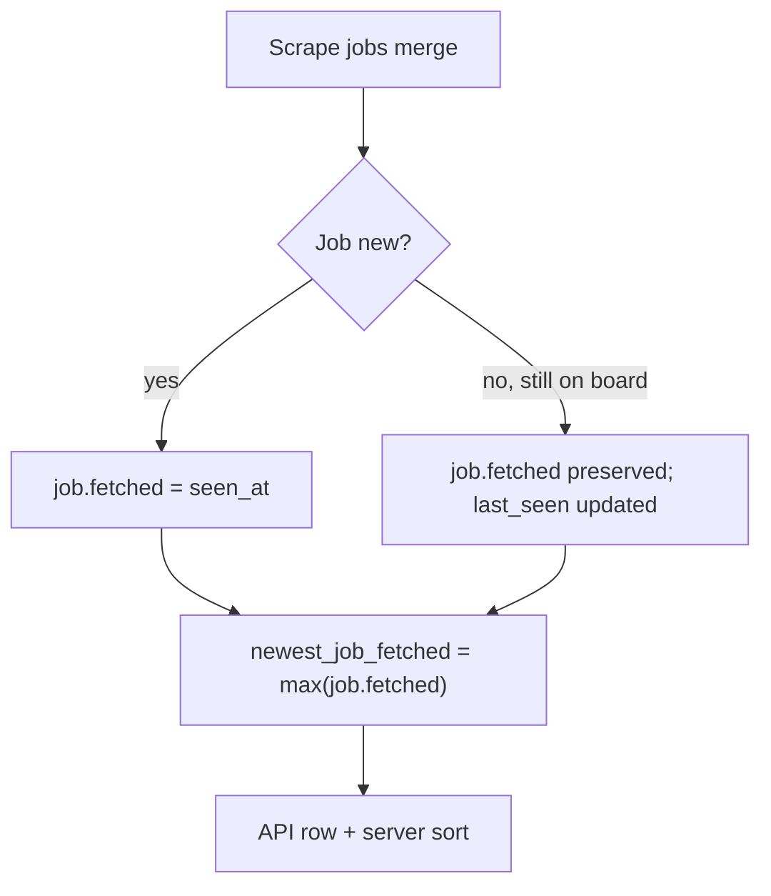

# Panel board — pagination, sort, and activity timestamps

**Last updated:** 2026-09-24

How the main company board loads, paginates, and sorts by “newest”. Read before changing `panel/`, `static/js/board*.js`, `static/js/render.js`, `static/js/company-display-order.js`, `static/js/job-board.js`, or `GET /api/board`.

Related: [business-rules.md](business-rules.md) (job buckets), [architecture.md](architecture.md) (panel read path). Performance / read-model proposal: [board-read-model-proposal.md](../proposals/board-read-model-proposal.md).

---

## Relocation vs remote domains

Two panels share the same board **read contract** (`companies` / `meta` / `user_stats`) and the same position **action** APIs (apply / reject / buckets). Pipelines and HTTP namespaces stay separate:

| | Relocation | Remote |
|--|------------|--------|
| UI | `/panel` | `/remote` |
| Board API | `GET /api/board` | `GET /api/remote/board` |
| Countries | `GET /api/countries` (no remote boards) | `GET /api/remote/countries` |
| Catalog | `catalog_kind=relocation` | `catalog_kind=remote` |
| Ingest | Country ATS + location gates | Aggregator boards + employer fan-out |

Shared helpers live in [`relocation_jobs/shared/board_contract.py`](../../relocation_jobs/shared/board_contract.py). Remote board orchestration is under [`relocation_jobs/remote/`](../../relocation_jobs/remote/). Do not gate remote behind a `board_kind` flag inside relocation routes.

Remote boards: `remote-ok`, `remote-dxb`, `remote-joblet`, `remote-kake` (Remotedxb is not under `uae`).

---

## Board load path

```
GET /api/board
  → opportunities.service.resolve_board_opportunity_scope()  # admin bypass / user_opportunities
  → panel/board.load_catalog_board_page(catalog_kind=relocation, opportunity_scope=…)
  → panel/service.flatten_companies_page()
      → catalog/repo.load_catalog_companies_page()   # DB batch, ORDER BY country, name
      → panel/flatten.flatten_company()              # per-user merge + filters
  → web/routes/board.py                              # meta (+ opportunity fields) + user_stats

GET /api/remote/board
  → same opportunity scope
  → panel/board.load_catalog_board_page(catalog_kind=remote)
  → same flatten path with catalog_kind=remote
```

Non-admin users only see companies present in `user_opportunities` (see [entitlements-and-opportunities.md](entitlements-and-opportunities.md)). Admins bypass.
Client:

```
board.js (fetch page via panelApiPrefix())
  → board-view.js syncBoardView()
  → render.js getDisplayCompanies()
      → applyPanelFilters()
      → sortCompaniesList()                          # client sort (see below)
  → React company cards (frontend/)
```

Toolbar layout: **pagination → search → sort/filters → company cards**.

### Roles per company (3 + load more)

Board company cards return at most **3** open roles in the page payload (`jobs_more`). `job_count` stays the full open-role total. Desktop and mobile share this. Further open roles load via `GET /api/board/company-roles` (and `/api/remote/board/company-roles`) in steps of 3.

---

## “Newest first” sort

Default sort is **Newest first** (`index.html` `#sortSelect`, mirrored by hidden `#sortNewestFetch`). Preference persists in `localStorage` (`panel_sort_newest`).

| Layer | Behavior |
|-------|----------|
| **Server** | When `sort=newest` (default), flattens all filter-visible companies, sorts by activity timestamp, then paginates. |
| **Client** | Sends `sort=newest|name`; for newest, re-sorts the current page by `newest_job_fetched` (frozen during active scrape fetch **and** while the user is interacting with positions on the page). |

Sort key: **max `job.fetched`** per company (`newest_job_fetched`). `company.updated` is not used for sort order.

### Calculated rank ≠ visible order during Panel interaction

Position actions and 3-role “load more” can change a company’s **calculated** `newest_job_fetched` immediately (client `recomputeNewestJobFetched`, and again on soft board reload after a credit reveal). That update must **not** reshuffle the company list under the user’s cursor.

| Concept | Where | Behavior while interacting |
|---------|--------|----------------------------|
| **Calculated rank** | `newest_job_fetched` on each company row | Continues to update in real time |
| **Visible order** | `state.frozenCompanyOrder` + `sortCompaniesNewest` / `getDisplayCompanies` | Stays on the snapshot taken when interaction started |

What freezes visible order:

- Active per-company scrape (`setFetchBusy` → `freezeCompanyOrder`)
- Local position mutations (`finalizeCompanyBoard` in `job-board.js`)
- Loading the next 3-role bucket (`appendCompanyRoles`)
- Soft board reload after a reveal / credits wall (`loadBoard({ stableOrder: true })`)

What still lets a company leave the active layout:

- **Exhaustion** — no open roles left in the loaded `jobs` list. With `hide_empty`, `evictCompanyIfHidden` / panel filters remove the company (same leave path as before this freeze work). That is intentional when there is nothing left on the card to interact with.

Reconciliation (visible order catches up to calculated rank):

- Full board reload without `stableOrder` (pagination, country/ATS/location/search, filter toggles, sort change)
- Scrape **settle** / non-session completion `loadJobs` (not merely `setFetchBusy(false)` — a single-company fetch session keeps the freeze until settle reload)
- Explicit `releaseCompanyOrder()` (e.g. sort select)

Invariant: while the user is working through positions on a page, a company must not jump solely because one role’s score/timestamp changed or another 3-role bucket was loaded. Ranking math is unchanged; only **when** rank is allowed to move cards changes.

During an active per-company fetch:

- Order is **frozen** (`freezeCompanyOrder`) so cards do not reshuffle as timestamps update.
- The company being fetched is pinned to the top with an optimistic `updated` / `newest_job_fetched` (`touchFetchingCompanyTimestamp`).

Alternative sort: **Company A–Z** (country label, then name).

### Pagination note

`sort=newest` scans and flattens the full visible catalog for the current scope/filters on each page request, then sorts before slicing. This is correct but heavier than `sort=name` (streaming catalog order). Cursor-based pagination remains a future optimization.

---

## Activity timestamp flow

What “newest” means for a company: **the latest `job.fetched` among open-board roles** (`jobs` bucket). Excludes not-for-me, rejected, and other non-main buckets.



### `company_newest_job_fetched` (server)

`shared/timestamps.py` — used when flattening each company row:

1. **max** of `job.fetched` over the main `jobs` bucket (after per-user partition).
2. Else **`company.added`** when the company has no open roles left.

### Job timestamps (scrape merge)

`scrape/merge.py` on each fetch:

| Field | Meaning |
|-------|---------|
| `fetched` | First time this job was discovered |
| `last_seen` | Last scrape that still saw the job on the ATS |

- **New job:** both set to `seen_at`.
- **Existing job seen again:** `fetched` preserved; `last_seen` updated to `seen_at`.
- **Stale job** (not on ATS this run): kept in catalog; timestamps unchanged.

### API row fields

`panel/flatten.py` `_build_company_row`:

| Field | Source |
|-------|--------|
| `newest_job_fetched` | `max(job.fetched)` over main-board `jobs` only |
| `latest_fetched` | Same as `newest_job_fetched` |
| `updated` | Raw `company.updated` from catalog (fetch metadata only; not used for newest sort) |

After a fetch, a company rises in sort order only when it has a **new or updated `job.fetched`** (typically a newly discovered role).

### When timestamps are written

| Event | What gets set |
|-------|----------------|
| Add company (panel) | `added`, `updated` = today |
| Per-company / country fetch completes | `company.updated` = ISO now |
| Country fetch finishes | `country_meta.last_fetch_new_jobs` = count of new jobs |
| Scrape merge | per-job `fetched` / `last_seen` |

`last_fetch_new_jobs` / `meta.latest_fetch_new_jobs` is a **stats counter** (“new jobs in last country fetch”). It is **not** used for company sort order.

---

## Pagination (visible offset)

`flatten_companies_page` scans the scoped catalog in DB order, applies flatten + panel filters, counts **visible** companies, skips `visible_offset`, returns up to `limit` rows.

- Filters and search affect which companies count toward pages. Hide-empty (after free-plan capacity re-inject) runs before the page slice so `total_pages` matches the rendered list.
- `meta.total_companies` / `total_pages` reflect visible count (computed on page 1).
- Catalog SQL order: `catalog/repo.py` → `ORDER BY c.country, c.name`.

---

## Key files

| Area | File |
|------|------|
| API | `web/routes/board.py` |
| Pagination + flatten | `panel/service.py`, `panel/flatten.py` |
| Timestamps | `shared/timestamps.py` |
| Scrape merge | `scrape/merge.py` |
| Client load | `static/js/board.js` |
| Client sort | `static/js/render.js` |
| Sort UI | `static/js/filters.js`, `static/js/storage.js` |

---

## MCP application flags on jobs

When a user is logged in, `GET /api/board` merges per-position MCP state from `mcp_applications` into each job row:

| Field | Meaning |
|-------|---------|
| `has_tailored_tex` | Tailored LaTeX saved for this position |
| `has_pdf` | Compiled PDF stored |
| `master_resume_slug` | Master variant used (e.g. `go`, `java`) |

Company name on the board links to the application workspace at `/company/<country>/<company-slug>`. See [company-workspace.md](company-workspace.md).
