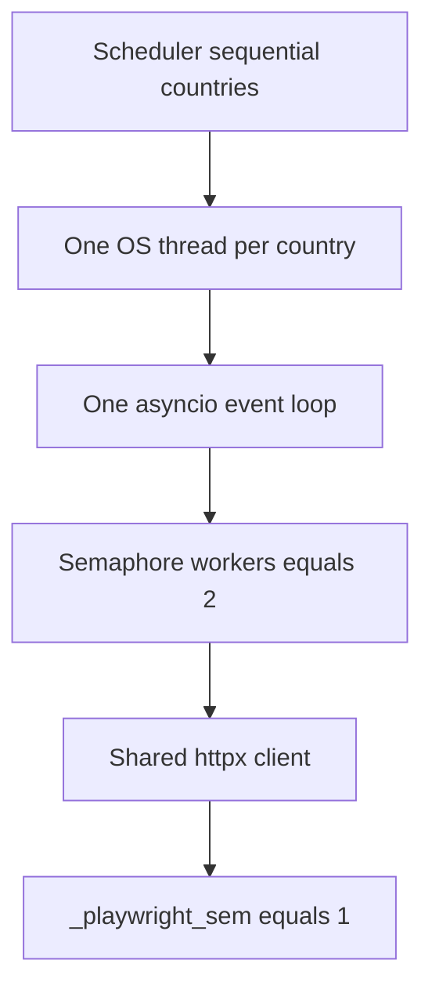

# Technical review: fetch concurrency (one event loop)

**Last updated:** 2026-09-06  
**Status:** review of the shipped concurrency-model change; measured after 2026-09-03 16:09 UTC

Country fetch no longer starts OS threads per company. Production died with `can't start new thread` from 2026-08-28; every scheduled country run failed from 2026-08-30. This is a review of the fix that landed, not a second postmortem.

Incident (symptoms, timeline, buggy code): [fetch-thread-exhaustion-incident.md](fetch-thread-exhaustion-incident.md)  
Related: [operations/ec2-panel.md](../operations/ec2-panel.md), [fetch-scheduler-timeout-practices.md](fetch-scheduler-timeout-practices.md)

---

## What we thought vs what was true

The board looked like most ATS sites had died. Grafana has no fetch logs. Docker stderr is wiped on deploy. Postgres `company_fetch_attempts.error_message` was the real record: **357 / 358** errors in seven days were `can't start new thread`.

That is `pthread_create` failing. On this box it is easy to read as “Python uses too much RAM” or “we need Go.” RAM is the **budget**. The **bug** was the concurrency model: thread-per-company with a nested event loop, plus Chromium.

---

## What the old path actually did

```text
scheduler (one country at a time)
  → threading.Thread                 # country worker — keep this
    → asyncio.run()                  # loop #1
      → ThreadPoolExecutor(4)
        → asyncio.run() per company  # loop #2  ← this is the bug
          → new httpx client (up to 16 conns)
          → Playwright (sem=2)
```

Three separate mistakes stacked:

1. **`asyncio.run()` inside a pool worker.** That is not asyncio concurrency. It is N OS threads, each with its own event loop. Coroutines never shared a loop, so `Semaphore` could not bound the process.
2. **A new httpx client per company**, sized by `_per_worker_limits` to 16 connections even when country concurrency was 4. The country-level client created in `_country_fetch_worker` was ignored on the concurrent path.
3. **`_finish` lied.** After the pool died, `progress.current` was set to `progress.total`. Germany showed `111/111` done, `new_jobs=0`, in ~0 seconds. The scheduler looked healthy.

Any ` — Error: …` message, including the infra string, set `fetch_problem` on the company. The UI then said “this company is broken.”

---

## What changed

### 1. One loop, bounded in-flight work

[`country_runner.py`](../../relocation_jobs/fetch/country_runner.py) deleted `_fetch_one_thread`, `ThreadPoolExecutor`, and `_per_worker_limits`.

The concurrent path is now the same as the old sequential path: `await asyncio.wait_for(fetch_and_persist_company(shared_client, ...))`. Parallelism is an `asyncio.Semaphore(workers)` plus `asyncio.gather`. Timeouts and exceptions are caught **per company**, so one SlowCo does not cancel the country.

The outer `threading.Thread` in [`runner.py`](../../relocation_jobs/fetch/runner.py) stays. The scheduler still joins it. That is one country thread, not N.

```text
scheduler
  → threading.Thread                 # unchanged
    → asyncio.run()                  # one loop for the country
      → Semaphore(workers)           # default 2
        → await fetch_and_persist_company(shared client)
          → Playwright under _playwright_sem=1
```



### 2. Shared client, smaller enrich fan-out

`_country_fetch_worker` already built an httpx client with `concurrency=workers`. Company tasks now use that client. Enrich concurrency is `min(4, workers)`, not 16-per-thread.

### 3. Production knobs

| Knob | Before | After |
|------|--------|--------|
| `FETCH_SCHEDULE_CONCURRENCY` default | 4 | **2** |
| Deploy worker/panel env | 4 | **2** |
| `_playwright_sem` | 2 Chromiums | **1** |

Playwright’s own `ThreadPoolExecutor(max_workers=1)` in `playwright_board.py` is still there. That is a wall-clock timeout around one sync scrape, not country parallelism. Left on purpose.

### 4. Honest progress and infra vs ATS

On `exit_code != 0`, `_finish` persists `companies_done`, not `total`. A dead run cannot look complete.

`is_infra_fetch_error()` (`can't start new thread`, `cannot allocate memory`, `too many open files`) still writes `company_fetch_attempts` as `ERROR`. It does **not** set `fetch_problem`. Real ATS failures (`connection refused`) still do. Both `fetch/service.py` and `scrape/company.py` share that predicate, because `process_company` used to persist the flag **before** `fetch_company` saw the message.

---

## Invariants this is trying to hold

1. At most `workers` company fetches in flight on one event loop.
2. At most one Chromium (`_playwright_sem=1`), even if two HTTP companies run.
3. One company timeout does not cancel the country.
4. A process-level failure is an attempt error, not a sticky catalog flag.
5. `companies_done` is work that actually finished, not `len(catalog)`.

---

## Tests that pin the behavior

- Sequential timeout still walks FastCo then SlowCo (`concurrency=1`).
- Concurrent timeout: `concurrency=2`, SlowCo times out, FastCo still counts, country is not cancelled.
- `country_runner` source no longer contains `ThreadPoolExecutor`, `_fetch_one_thread`, or `asyncio.run(`.
- Unset env → `schedule_concurrency() == 2`.
- `connection refused` still sets `fetch_problem`; `can't start new thread` does not (service + `process_company`).

`pytest tests/fetch tests/scrape/test_company.py` → 43 passed.

---

## What this does not fix

The board will still look dirty after deploy:

- Existing **186 `fetch_problem` flags** are not cleared. That is a later SQL/ops pass.
- **313 `running` attempt rows** from June–August are still orphans.
- Scheduler still starts countries with **no catalog** (`austria`, `uae`, `united-state`, …).
- Admin UI still does not show `error_message` (`GET /api/fetch/attempts` exists, unused).
- Playwright still uses `asyncio.to_thread` + a 1-thread pool for the watchdog. That is one extra OS thread per in-flight generic scrape, now serialized by the semaphore.
- `asyncio.gather` on 100+ stubs is cheap (coroutines wait on the semaphore). Cancel is cooperative: in-flight companies finish or hit `wait_for`; queued ones see `cancel_requested` when they acquire the slot.

A Go HTTP sidecar was the wrong response to this outage. HTTP ATS would get cheaper there; Chromium would not. The worker was already a separate container. The code path was the problem.

---

## After deploy (measured 2026-09-06)

Do **not** score this change on Germany/Netherlands wall clock. Healthy duration was concurrency **4** on the thread pool; after is concurrency **2** on the event loop. Outage runs were ~0s with `new_jobs = 0` — not a speed baseline. Two knobs moved in one deploy.

The number that belongs to the model: `can't start new thread`. First production run with `concurrency = 2`: Armenia at **2026-09-03 16:09 UTC**. Empty scheduler countries (`austria`, `joblet`, `mauritius`, `uae`, `united-state`) still fail with `No catalog` and are excluded from completion counts.

| Signal | Value |
|--------|--------|
| Outage attempt errors | **357 / 358** `can't start new thread` |
| Attempts after 3 Sep 16:09 UTC | **3,375 / 3,375** `ok`, **0** thread errors |
| Real catalogs 30–31 Aug | **0 / 91** ok, **0** new jobs |
| Real catalogs after the cut | **153 / 154** ok, 160 new jobs (healthy 20–27 Aug: 345 / 352) |
| Board `fetch_problem` | **3 / 401** (186 / 394 on 1 Sep). Remaining: arculus, bol, Channable — dated 6 Sep, real ATS |

The one miss is Germany run 3991 (5 Sep 11:00 UTC): `90/111`, exit 1, not a thread error. Next cycle `111/111`.

Grafana Cloud is host health (disk, `MemAvailable`, `/api/health`); fetch outcomes live in Postgres. Public write-up: [kuchup.com/engineering/one-loop-not-faster](https://kuchup.com/engineering/one-loop-not-faster).

The incident file still quotes the buggy code. This review is the “what we shipped and why it is the right seam.”

---

## Related

- [fetch-thread-exhaustion-incident.md](fetch-thread-exhaustion-incident.md) — production outage, evidence, old code
- [fetch-scheduler-timeout-practices.md](fetch-scheduler-timeout-practices.md) — hang/timeout incident (2026-07)
- [operations/ec2-panel.md](../operations/ec2-panel.md) — worker deploy, concurrency env
- Public post: [one-loop-not-faster](https://kuchup.com/engineering/one-loop-not-faster)
