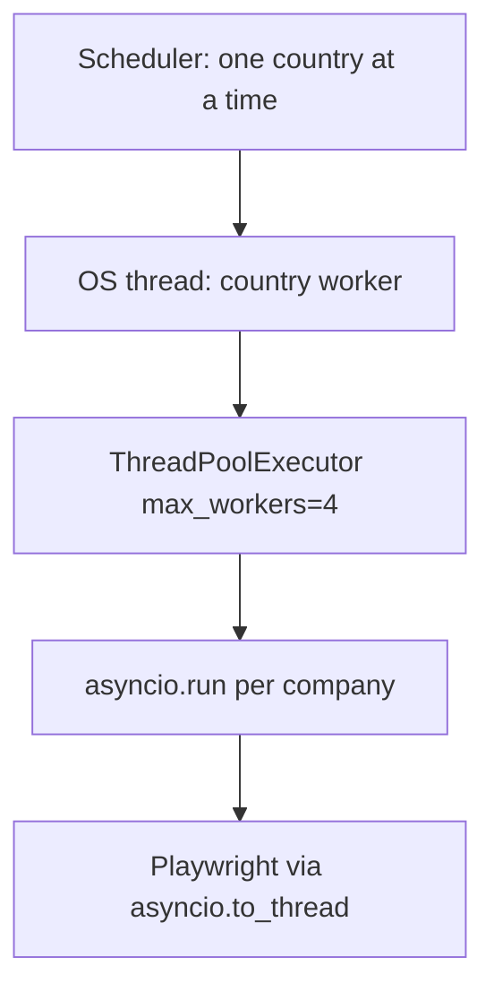

# When most companies looked broken: fetch thread exhaustion

**Last updated:** 2026-09-02  
**Status:** fix shipped (concurrency model); existing `fetch_problem` flags still need a catalog cleanup

On 2026-09-01 the production board showed a fetch problem on most companies. It looked like ATS sites or scrapers had died. They had not. The EC2 fetch worker could not start OS threads, so every 6-hour country cycle failed in about a second and stamped `fetch_problem` on the catalog.

Related: [operations/ec2-panel.md](../operations/ec2-panel.md), [operations/monitoring.md](../operations/monitoring.md), [fetch-scheduler-timeout-practices.md](fetch-scheduler-timeout-practices.md), [kafka-fetch-pipeline-proposal.md](kafka-fetch-pipeline-proposal.md)

---

## Executive summary

| | |
|---|---|
| **Symptom** | Board showed fetch problems on most companies; scheduled country runs all `failed` with `Finished (exit 1)` and `new_jobs = 0`. |
| **User impact** | Catalog went stale from **2026-08-30** onward. **186 / 394** companies flagged `fetch_problem` (germany 85, netherlands 84, plus a handful elsewhere). |
| **What it was not** | ATS outages, “Python asyncio uses too much RAM,” or a reason to rewrite fetch in Go. Low RAM on `t4g.micro` is the **constraint**, not the bug. |
| **Root cause** | `RuntimeError: can't start new thread` — `pthread_create` failed. Country fetch nests an OS thread, a `ThreadPoolExecutor`, and `asyncio.run()` per company (plus Playwright on generic boards). |
| **First seen** | 2026-08-28 12:50 UTC. Spike 2026-08-29 07:00 (173 errors in one hour). **Every scheduled country run since 2026-08-30 failed** in ~1s. Last healthy country runs: **2026-08-29**. |
| **Outcome** | Diagnosed from Postgres (`company_fetch_attempts`, `fetch_runs.log_json`). **2026-09-02:** country fetch uses one event loop + `asyncio.Semaphore`; infra errors no longer set `fetch_problem`; production concurrency default is **2**. |

---

## What we saw

Production worker (`relocation-fetch-worker` on EC2) still ran its 6-hour loop. Cycles “finished,” so the container looked healthy. The board then showed red fetch-problem flags on a large share of companies.

Postgres on 2026-09-01:

| Signal | Value |
|--------|--------|
| Attempt errors last 7 days | **357 / 358** were `can't start new thread` |
| Latest country runs (ids 3701–3715, 07:32 UTC) | All `status=failed`, `exit_code=1`, ~0s duration |
| Germany / Netherlands that cycle | `111/111` and `95/95` “done”, `new_jobs=0` |
| `fetch_runs.log_json` | `["Error: can't start new thread","Finished (exit 1)"]` |
| Companies with `fetch_problem = 1` | **186 / 394** |
| Last successful country fetch | 2026-08-29 (switzerland last; germany last ok at 07:20 that day) |

`111/111` is bookkeeping, not a scrape. The pool fails immediately; finalize still sets `progress.current = total`.

Same-second timestamps across countries are consistent with sequential scheduling: each country dies in under a second, so a 16-country cycle completes in ~2s.

---

## Where the logs actually live

Grafana Cloud is **metrics only** (disk, RAM, `/api/health`). It does not store fetch logs.

| Place | What it keeps | Durable? |
|-------|----------------|----------|
| `company_fetch_attempts.error_message` | Per-company failure string | **Yes — look here first** |
| `fetch_runs.log_json` / `result_line` | Country-run summary | Yes |
| `companies.fetch_problem` | Sticky board flag | Yes (flag only, not the error) |
| `GET /api/fetch/attempts` | Same attempt rows | Yes; UI does not show them |
| Admin / stats fetch-runs table | Duration, new jobs, exit status | High-level only |
| `docker logs relocation-fetch-worker` | Verbose `[FETCH]` HTTP lines | **No** — wiped on `docker rm -f` deploy; no log rotation |
| Grafana Alloy | Prometheus remote_write | Not application logs |

SSH to the instance from the investigation laptop timed out, so Docker stderr was unreachable. Postgres was enough.

Useful aggregations (production `DATABASE_URL`, no secrets in output):

```sql
SELECT status, COUNT(*) FROM company_fetch_attempts GROUP BY 1;
SELECT LEFT(error_message, 180), COUNT(*)
FROM company_fetch_attempts WHERE status = 'error'
GROUP BY 1 ORDER BY 2 DESC LIMIT 20;
SELECT id, country, status, companies_done, companies_total, new_jobs,
       LEFT(result_line, 80)
FROM fetch_runs ORDER BY id DESC LIMIT 15;
```

---

## Architecture context

Fetch is already a **separate container**. The code is not a separate system: the worker imports `relocation_jobs.fetch` + `scrape` + `catalog` and writes the same Postgres as the panel.

```text
scheduler.run_fetch_cycle
  → start_country_fetch          threading.Thread
    → _country_fetch_worker      asyncio.run (country event loop)
      → run_country_fetch
        → ThreadPoolExecutor(concurrency=4)
          → _fetch_one_thread    asyncio.run AGAIN (loop per company)
            → fetch_and_persist_company
              → HTTP ATS and/or Playwright Chromium (asyncio.to_thread)
```

Deploy default: `FETCH_SCHEDULE_CONCURRENCY=4`. Each pool worker also gets HTTP/enrich limits up to 16 (`_per_worker_limits`). Generic boards may start Playwright.

That is **thread-per-company with a nested event loop**, not a coroutine pool. Python coroutines are cheap. OS threads (~8MiB stacks) and Chromium (hundreds of MiB) are not. `can't start new thread` means `pthread_create` failed (typically `ENOMEM` or PID/nproc limit), not “asyncio RAM is uncontrollable.”



The July 2026 hang incident ([fetch-scheduler-timeout-practices.md](fetch-scheduler-timeout-practices.md)) added layered timeouts. Those timeouts do not bound **how many OS threads and browsers exist**. This incident is that next failure mode.

---

## The code that caused it

The code below is the **buggy** model as of 2026-09-01. It has been replaced (see [Fix shipped](#fix-shipped-2026-09-02)).

```python
# relocation_jobs/fetch/scheduler.py
def schedule_concurrency() -> int:
    raw = (os.environ.get("FETCH_SCHEDULE_CONCURRENCY") or "4").strip()
    try:
        return max(1, min(int(raw), MAX_CONCURRENCY))
    except (TypeError, ValueError):
        return 4
```

### Layer 1 — country fetch is already an OS thread

`run_fetch_cycle` calls `start_country_fetch`, which starts `_country_fetch_worker` on a **daemon thread**, then that thread calls `asyncio.run` (first event loop):

```python
# relocation_jobs/fetch/runner.py — start_country_fetch
thread = threading.Thread(
    target=_country_fetch_worker,
    args=(country_key,),
    kwargs={
        "run_id": run_id,
        "skip_filled": skip_filled,
        "ats_type": ats_type,
        "concurrency": workers,
    },
    daemon=True,
)
fetch_state.set_fetch_thread(thread)
thread.start()
```

```python
# relocation_jobs/fetch/runner.py — _country_fetch_worker
async def _run():
    nonlocal new_jobs_total, companies_done, cancelled
    async with make_fetch_client(concurrency=concurrency) as client:
        return await run_country_fetch(
            client,
            country_key,
            run_id=run_id,
            skip_filled=skip_filled,
            ats_type=ats_type,
            concurrency=concurrency,
            on_progress=on_progress,
            on_log=append_log,
            on_company_result=on_company_result,
        )

new_jobs_total, companies_done, cancelled = asyncio.run(_run())  # loop #1
```

When `ThreadPoolExecutor` / `pthread_create` fails, this `except` is what wrote `Error: can't start new thread` into `fetch_runs.log_json`:

```python
# relocation_jobs/fetch/runner.py — _country_fetch_worker
except Exception as exc:
    append_log(f"Error: {exc}")
    exit_code = 1
```

Then `_finish` still marks the run fully complete if `progress.total` was already set (germany `111/111` with zero jobs):

```python
# relocation_jobs/fetch/runner.py — _country_fetch_worker._finish
prog = dict(st.get("progress") or {})
total = int(prog.get("total") or 0)
if total > 0 and not cancelled:
    st["progress"] = {**prog, "current": total, "status": "done"}
```

`run_country_fetch` calls `report(0, None, "starting")` before the pool is created, so `total` is already 111 when thread creation fails.

### Layer 2 — THE BUG: ThreadPoolExecutor + asyncio.run per company

When `concurrency > 1` (production: 4), the country loop does **not** stay on the existing event loop. It opens a thread pool and each company starts **another** event loop:

```python
# relocation_jobs/fetch/country_runner.py — run_country_fetch
workers = max(1, min(concurrency, total))
http_concurrency, enrich_concurrency = _per_worker_limits(workers)
# with workers=4 → http_concurrency = enrich_concurrency = 16
...
if workers <= 1:
    # sequential await on the country loop — this path is fine
    ...
else:
    pool = ThreadPoolExecutor(max_workers=workers)  # 4 OS threads
    ...
    f = pool.submit(
        _fetch_one_thread,
        country_key, name, index, total,
        run_id=run_id,
        http_concurrency=http_concurrency,
        enrich_concurrency=enrich_concurrency,
        on_company_result=on_company_result,
    )
```

```python
# relocation_jobs/fetch/country_runner.py — _per_worker_limits
def _per_worker_limits(country_workers: int) -> tuple[int, int]:
    workers = max(1, country_workers)
    limit = min(16, max(12, 192 // workers))
    return limit, limit
```

```python
# relocation_jobs/fetch/country_runner.py — _fetch_one_thread
async def _inner():
    async with make_fetch_client(concurrency=http_concurrency) as client:
        return await asyncio.wait_for(
            fetch_and_persist_company(...),
            timeout=company_timeout_seconds(),
        )

try:
    msg, new_count = asyncio.run(_inner())  # loop #2 — THE BUG
    return name, new_count, False, msg
except Exception as exc:
    return name, 0, False, f"[{index}/{total}] {name} — Error: {exc}"
```

`asyncio.run()` inside a pool worker is what produced the per-company attempt error `can't start new thread` (the exception is stringified into the ` — Error: …` message). Four of those workers exist at once, each with its own httpx client sized up to 16.

The `workers <= 1` branch already does the right thing: `await fetch_and_persist_company(...)` on the country loop. Concurrency 4 never uses that path.

### Layer 3 — Playwright adds more OS threads

HTTP ATS failures fall through to a **sync** Chromium scrape on yet another thread:

```python
# relocation_jobs/scrape/boards/_async.py
async def run_sync(sync_fn, *args, **kwargs):
    return await asyncio.to_thread(sync_fn, *args, **kwargs)

async def fetch_with_playwright_fallback(api_fetch, page_url, *, playwright_fallback=None):
    fallback = playwright_fallback or scrape_board_with_playwright
    try:
        return await api_fetch()
    except Exception:
        return await run_sync(fallback, page_url)
```

So one in-flight generic company can be: country thread + pool thread + `asyncio.run` loop + `asyncio.to_thread` + Chromium. That is the RAM/PID amplifier on `t4g.micro`. It is not the exception string we saw on 2026-09-01 (the pool died before boards ran); it is why the process was already unable to start threads after days of cycles.

### Why the board said “company is broken”

Any ` — Error: …` message, including the infra error, sets the sticky catalog flag:

```python
# relocation_jobs/fetch/service.py
_ERROR_RE = re.compile(r" — Error: (.+)$")

def _mark_fetch_problem(company: dict) -> None:
    company["fetch_problem"] = True
    company["fetch_problem_date"] = _today()
    company["fetch_ok"] = False
    company.pop("fetch_ok_date", None)

# inside fetch_company, after process_company returns:
err_match = _ERROR_RE.search(msg)
if err_match:
    _mark_fetch_problem(company)
    _record_finish(
        attempt_id,
        status=AttemptStatus.ERROR,
        error_message=err_match.group(1),  # "can't start new thread"
        ...
    )
```

There is no distinction between “Greenhouse returned garbage” and “this process cannot create a thread.”

---

## Fix shipped (2026-09-02)

Country fetch no longer starts a `ThreadPoolExecutor` or calls `asyncio.run()` per company. The outer country `threading.Thread` remains so the scheduler can join it. Companies run on that thread’s **one** event loop, bounded by `asyncio.Semaphore(workers)`, sharing the httpx client from `_country_fetch_worker`.

```text
scheduler.run_fetch_cycle
  → start_country_fetch          threading.Thread (one per country)
    → _country_fetch_worker      asyncio.run (one loop)
      → run_country_fetch
        → asyncio.Semaphore(workers)   default 2
          → await fetch_and_persist_company(shared client)
            → HTTP ATS; Playwright under _playwright_sem=1
```

| Change | Where |
|--------|--------|
| Delete `_fetch_one_thread` + `ThreadPoolExecutor` | `fetch/country_runner.py` |
| `asyncio.Semaphore` + `asyncio.gather`; per-company `wait_for` | `fetch/country_runner.py` |
| Do not set `progress.current = total` on `exit_code != 0` | `fetch/runner.py` |
| Do not set `fetch_problem` for infra errors (`can't start new thread`, …) | `fetch/service.py`, `scrape/company.py` |
| Default `FETCH_SCHEDULE_CONCURRENCY` **2** | `fetch/scheduler.py`, `scripts/ec2_app_deploy.sh` |
| `_playwright_sem` **1** | `core/ats_detection.py` |

After deploy: restart `relocation-fetch-worker`. Confirm the next cycle in Postgres — `error_message` should not be `can't start new thread`. Sticky `fetch_problem` rows from this incident stay until a later cleanup.

---

## Timeline

| When (UTC) | What |
|------------|------|
| 2026-07-10 | Playwright hang on endios; country join had no timeout; worker restarted by hand |
| 2026-07-10 | Timeouts shipped (`FETCH_COMPANY_TIMEOUT_SECONDS=300`, country join 2700s, Playwright 90s) |
| 2026-08-28 12:50 | First `can't start new thread` attempt error |
| 2026-08-29 07:00 | **173** thread errors in one hour; some countries still completed later that day |
| 2026-08-29 19:29 | Last successful country run (`switzerland`) |
| 2026-08-30 onward | **All** scheduled country runs `failed`; 64 failed runs/day on 30–31 Aug |
| 2026-09-01 07:32 | Full cycle failed in ~2s; germany/netherlands marked fully “done” with 0 jobs |
| 2026-09-01 ~11:30 | Investigation via Postgres; Docker logs not reachable (SSH timeout) |

---

## Why it was misleading

Three things hid the real failure:

1. **The board language is “this company is broken.”** `_mark_fetch_problem` sets `fetch_problem` on any attempt message matching ` — Error: …`, including infra errors. Operators then debug Greenhouse/Ashby instead of the worker process.
2. **Runs look complete.** `companies_done == companies_total` and the scheduler logs a finished cycle. Duration is ~0s; `new_jobs` is 0. The stats table does not show `error_message`.
3. **RAM is the obvious suspect** on `t4g.micro` (docs already warn OOM at concurrency 4; worker ~560MiB idle). Adding RAM or rewriting in Go would not fix thread-per-company + Chromium. A bigger box would only delay the same model.

---

## Secondary issues found in the same data

Not the outage, but they showed up in the 07:32 cycle and in history:

| Issue | Evidence |
|-------|----------|
| Scheduler countries with **no catalog** | `austria`, `joblet`, `mauritius`, `uae`, `united-state` → `Error: No catalog for country: …` |
| Stuck `running` attempts | 313 rows, oldest 2026-06-24, newest 2026-08-29 — orphans, not live threads |
| Docker logs are not an archive | Recreated on every deploy; Grafana has no Loki |
| Attempt API unused in UI | `GET /api/fetch/attempts` exists; board never shows `error_message` |

---

## What we are not doing (yet)

A Go rewrite with goroutines was discussed as a memory fix. **Rejected as the response to this outage.**

- HTTP ATS (Greenhouse, Ashby, Lever, …) would get cheaper in Go. That is not what died here.
- Playwright/Chromium would cost the same RAM in Go (`chromedp` / rod) or still live in Python.
- Fetch is already a separate **container**. Splitting languages without a Postgres job contract duplicates ~20 ATS parsers and the scrape suite.

The concurrency model **changed in this Python worker** (one event loop, bounded semaphore, infra errors do not flag `fetch_problem`). A Postgres `fetch_jobs` queue and a later Go HTTP sidecar stay on the table; they are not this incident’s fix.

---

## After deploy

1. Restart the worker: `docker restart relocation-fetch-worker` (needs SSH; may not recover if the host is wedged — prefer instance stop/start over terminate; `pgdata` is a named volume).
2. Confirm the next cycle in Postgres, not in the board flags: `error_message` should not be `can't start new thread`.
3. Existing `fetch_problem` flags from this incident are **not** cleared automatically.

---

## Follow-up (not this change)

1. ~~Replace `ThreadPoolExecutor` + `asyncio.run()` per company~~ **done 2026-09-02**
2. ~~Stop setting `fetch_problem` for infra errors~~ **done 2026-09-02**
3. Surface `company_fetch_attempts.error_message` in admin (or the attempts API on the board).
4. Drop scheduler countries that have no catalog.
5. Reap or explain the 313 `running` attempt rows.
6. Clear stale `fetch_problem` flags that were set by `can't start new thread`.

---

## Related

- [fetch-concurrency-model-review.md](fetch-concurrency-model-review.md) — what shipped and why
- [fetch-scheduler-timeout-practices.md](fetch-scheduler-timeout-practices.md) — hang/timeout incident (2026-07)
- [operations/ec2-panel.md](../operations/ec2-panel.md) — worker deploy, concurrency env
- [operations/monitoring.md](../operations/monitoring.md) — Grafana metrics, host-hung 522
- [kafka-fetch-pipeline-proposal.md](kafka-fetch-pipeline-proposal.md) — queue vs in-process threads (not approved)
