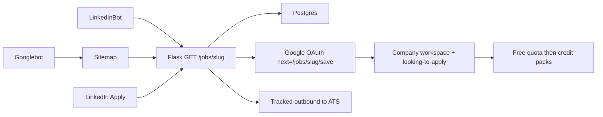

# Job wrapping / syndication funnel

**Last updated:** 2026-09-06

Public `/jobs/<slug>` pages so LinkedInBot and Googlebot can read visa-sponsored catalog roles as `schema.org/JobPosting`, and so a LinkedIn Apply click lands on Kuchup instead of bouncing to the employer ATS.

Related: [seo-indexing.md](../operations/seo-indexing.md) (Search Console, sitemaps), [catalog-pattern.md](catalog-pattern.md) (shared catalog vs per-user overlay), [entitlements-and-opportunities.md](entitlements-and-opportunities.md) (Free credits / MCP quota), [company-workspace.md](company-workspace.md) (where save lands), [mcp-application.md](mcp-application.md) (CV reframe after save).

---

## Why this exists

LinkedIn’s crawler already picked up a few strings from country marketing pages and posted them as Basic Jobs on the Kuchup company page. This funnel makes that intentional:

1. **Discover** — crawlers get raw HTML + JSON-LD (no JS, no login).
2. **Map to Kuchup** — `hiringOrganization` is Kuchup so LinkedIn attaches the posting to our company page, not the employer’s.
3. **Capture** — Apply goes to `https://kuchup.com/jobs/<slug>`. We do **not** auto-redirect to the ATS.
4. **Convert** — primary CTA creates a Free account, marks the role looking-to-apply, and opens the company workspace. Credit packs / MCP quota walls come later.

Country marketing pages (`/relocation-jobs-*`) stay in the Next.js static export. Job detail URLs cannot: they change every 6-hour fetch, need 410 when a role closes, and must read Postgres. Those pages are Flask SSR.

---

## Public URLs

| Path | Status | Who |
|------|--------|-----|
| `GET /jobs/<slug>` | 200 open · **410** closed · 404 unknown | Crawlers + humans. JSON-LD only on 200. |
| `GET /jobs/<slug>/save` | 302 | Humans. Unauthenticated → Google OAuth with `next=`. Authenticated → looking-to-apply, then `/company/<country>/<company-slug>`. `X-Robots-Tag: noindex`. |
| `GET /jobs/<slug>/employer` | 302 | Humans. Logs `employer_outbound`, then redirects to the ATS URL. `noindex`. |
| `GET /sitemap-jobs.xml` | 200 | Crawlers. Visa-positive, not closed, slug present. |
| `GET /robots.txt` | 200 | Lists both `/sitemap.xml` and `/sitemap-jobs.xml`. |
| `GET /logo.png` | 200 | JSON-LD `hiringOrganization.logo`. Alias of the bird PNG. |

Cache: open job pages and the jobs sitemap use `public, max-age=300, stale-while-revalidate=86400`. Closed pages are `no-store`.

The jobs sitemap is generated on each `GET /sitemap-jobs.xml` from Postgres (`list_active_public_job_sitemap_entries`). Do not maintain a static `sitemap-jobs.xml` file. After a fetch/merge, visa-positive open roles with a `public_slug` appear; roles the ATS dropped get `closed_at` and fall out. Cache is `max-age=300`, so crawlers may lag a few minutes.

That is separate from `/sitemap.xml`, which is the static Next export and only changes on a marketing deploy.

**Syndication set:** `visa_sponsorship = 1` only. The JSON-LD title always includes `(Visa Sponsorship)`. Unknown or negative-visa roles are not public listings.

---

## Data

Catalog columns on `matching_jobs` (migration `catalog_public_job_syndication_v1` in [`catalog/schema.py`](../../relocation_jobs/catalog/schema.py)):

| Column | Role |
|--------|------|
| `public_slug` | Stable URL key. Unique when non-empty. Set once, never rewritten when the title changes. Collision: `{base}-{id}`. |
| `closed_at` | Set when merge keeps a job that the latest scrape dropped (`stale_kept`), or when the listing-check probe sees the employer URL gone twice. Cleared when the role reappears on a board scrape. Empty string = open. Rows are **not** hard-deleted. |
| `listing_misses` | Consecutive closed probes. Reset to 0 when the probe sees the posting open or when merge sees it on the ATS board. Close at 2 (override `FETCH_LISTING_CHECK_MISSES`). |

Slug shape: `slug_from_name(company) + "-" + slug_from_name(title)` ([`core/slug.py`](../../relocation_jobs/core/slug.py) `public_job_slug_base`). Example: FlixBus + Senior Backend Engineer → `flixbus-senior-backend-engineer`.

Visa-positive rows are backfilled on migrate. Later upserts assign a slug to any job missing one so a later visa-positive flip still gets a URL.

Merge behavior ([`scrape/merge.py`](../../relocation_jobs/scrape/merge.py)): scrape still keeps stale jobs in the catalog. The public site treats `closed_at` as gone: 410 + drop from the jobs sitemap. The panel hides closed roles from the main board unless the user already applied or marked looking-to-apply.

A second closer runs in the fetch worker **before** country scrapes ([`fetch/listing_check.py`](../../relocation_jobs/fetch/listing_check.py)): httpx GET of `matching_jobs.url` (not kuchup.com). 404/410, ATS not-found, or closed copy increments `listing_misses`; two misses set `closed_at`. Timeouts, 429, 403, and 5xx are unknown and do not increment. Env: `FETCH_LISTING_CHECK_ENABLED` (default on with the scheduler), `FETCH_LISTING_CHECK_LIMIT=200`, `FETCH_LISTING_CHECK_CONCURRENCY=2`, `FETCH_LISTING_CHECK_MISSES=2`.

Repo (SQL only here):

- `get_public_job_by_slug(slug)` — join company; includes closed rows
- `list_active_public_job_sitemap_entries()` — visa-positive, `closed_at` empty, slug present
- `list_open_jobs_for_listing_check(limit)` — open URLs, public visa+slug first
- `apply_listing_check_results(rows)` — write `listing_misses` / `closed_at`

---

## JSON-LD

Built in [`catalog/service.py`](../../relocation_jobs/catalog/service.py) `job_posting_json_ld` (no SQL). Injected in the first HTML response (`<script type="application/ld+json">`).

| Field | Source |
|-------|--------|
| `title` | `{title} at {company} (Visa Sponsorship)` |
| `description` | Sanitized HTML from `format_job_description` plus a Kuchup note |
| `identifier` | Kuchup + catalog `id` |
| `datePosted` | `fetched` / `last_seen` as `YYYY-MM-DD` |
| `validThrough` | `datePosted + 30 days` while open; `closed_at` when closed |
| `employmentType` | `FULL_TIME` (not scraped yet) |
| `hiringOrganization` | Kuchup, `sameAs` `https://kuchup.com`, `logo` `https://kuchup.com/logo.png` |
| `jobLocation.addressCountry` | ISO from country key (`uk`→`GB`, `germany`→`DE`, …) |
| `jobLocation.addressLocality` | Job `location` (first comma segment) or company `city` |
| `url` / `applyUrl` | `https://kuchup.com/jobs/<slug>` (Google uses `url`; `applyUrl` is the LinkedIn-oriented extra) |

`hiringOrganization.name = "Kuchup"` is deliberate so LinkedIn maps the posting to the company page. The real employer is in the title and description. Google Jobs may ignore or downrank a hiring org that is not the employer — LinkedIn wrapping is the distribution target. Ops notes: [seo-indexing.md](../operations/seo-indexing.md).

---

## Interstitial (conversion)

Template: [`web/templates/job_posting.html`](../../relocation_jobs/web/templates/job_posting.html) + [`static/job-posting.css`](../../relocation_jobs/static/job-posting.css) (design tokens, not the Next Header).

Do not send cold traffic to `/pricing` first.

- Header: title, employer, location, visa badge (only if `visa_sponsorship` is true)
- Body: sanitized description HTML
- Sticky CTA: **Track & prepare this application in Kuchup** → save/OAuth
- Secondary text link (signed in only): **Continue to the official {employer} career page** → `/employer`
- Value prop: workspace + MCP; Free is 30 credits/month and 20 MCP writes/day

Save does **not** spend a credit (looking-to-apply is a free tracking action). Monetization is the existing Free wall: company slots, replacement-role credits, MCP daily quota — [entitlements-and-opportunities.md](entitlements-and-opportunities.md).

---

## HTTP map

Routes live in [`web/routes/job_pages.py`](../../relocation_jobs/web/routes/job_pages.py), registered from [`web/routes/__init__.py`](../../relocation_jobs/web/routes/__init__.py). Explicit `/jobs/<slug>` wins over the marketing catch-all `/<path:slug>` in [`web/server.py`](../../relocation_jobs/web/server.py).

`/logo.png` and the extra robots sitemap line are in `web/server.py`.

---

## Tests

| File | Covers |
|------|--------|
| [`tests/scrape/test_merge.py`](../../tests/scrape/test_merge.py) | `closed_at` set on stale, cleared on rescrape; slug preserved; `listing_misses` reset |
| [`tests/scrape/test_listing_status.py`](../../tests/scrape/test_listing_status.py) | 404 closed, 429 unknown, closed copy, Greenhouse/Ashby probes |
| [`tests/fetch/test_listing_check.py`](../../tests/fetch/test_listing_check.py) | Two misses set `closed_at`; unknown does not increment; open resets misses |
| [`tests/catalog/test_public_jobs.py`](../../tests/catalog/test_public_jobs.py) | Stable slug, collision suffix, persist closed, JSON-LD hiring org |
| [`tests/web/test_job_pages.py`](../../tests/web/test_job_pages.py) | 200 + JSON-LD, 404, 410, sitemap visa-only, OAuth `next`, save → workspace, employer 302 |
| [`tests/web/test_public_api.py`](../../tests/web/test_public_api.py) | robots lists both sitemaps; `/logo.png` |
| [`tests/helpers/route_manifest.py`](../../tests/helpers/route_manifest.py) | Job page routes in the panel route manifest |

---

## Code map

| Path | Role |
|------|------|
| [`catalog/schema.py`](../../relocation_jobs/catalog/schema.py) | `public_slug` / `closed_at` / `listing_misses` migrations + visa backfill |
| [`catalog/repo.py`](../../relocation_jobs/catalog/repo.py) | Persist slug/closed; public + listing-check queries |
| [`catalog/service.py`](../../relocation_jobs/catalog/service.py) | JSON-LD, ISO country, closed/public predicates, workspace path |
| [`scrape/listing_status.py`](../../relocation_jobs/scrape/listing_status.py) | Employer-URL probe: open / closed / unknown |
| [`fetch/listing_check.py`](../../relocation_jobs/fetch/listing_check.py) | Scheduled listing check before country scrape |
| [`core/slug.py`](../../relocation_jobs/core/slug.py) | `public_job_slug_base` |
| [`scrape/merge.py`](../../relocation_jobs/scrape/merge.py) | Stale → `closed_at`; rescrape clears it; keep `public_slug` |
| [`scrape/descriptions.py`](../../relocation_jobs/scrape/descriptions.py) | `format_job_description` for page body + JSON-LD HTML |
| [`web/routes/job_pages.py`](../../relocation_jobs/web/routes/job_pages.py) | SSR, save, employer outbound, `/sitemap-jobs.xml` |
| [`web/templates/job_posting.html`](../../relocation_jobs/web/templates/job_posting.html) | Interstitial HTML |
| [`static/job-posting.css`](../../relocation_jobs/static/job-posting.css) | Public job page chrome |
| [`web/server.py`](../../relocation_jobs/web/server.py) | `/logo.png`, robots second sitemap, Jinja `template_folder` |
| [`positions/service.py`](../../relocation_jobs/positions/service.py) | `set_job_looking_to_apply` on save |
| [`homepage/`](../../homepage/) | Marketing only (`output: "export"`). No `/jobs/[slug]` route. |

---

## What this is not

- Not a Next.js SSR/ISR app. The homepage remains a static export copied into Flask.
- Not Google Jobs-first. Mis-attributed `hiringOrganization` is a known trade-off.
- Not an auto-apply or ATS proxy. The secondary button is a tracked exit to the employer.
- Not a change to panel board privacy. `/panel`, `/apply`, `/company`, `/api/` stay `Disallow` in robots. Only visa-positive catalog rows get a public slug page.
